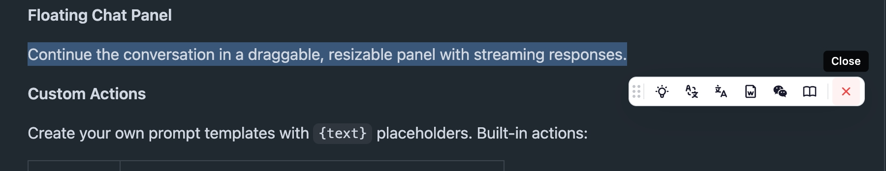
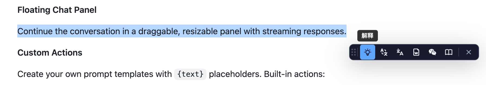
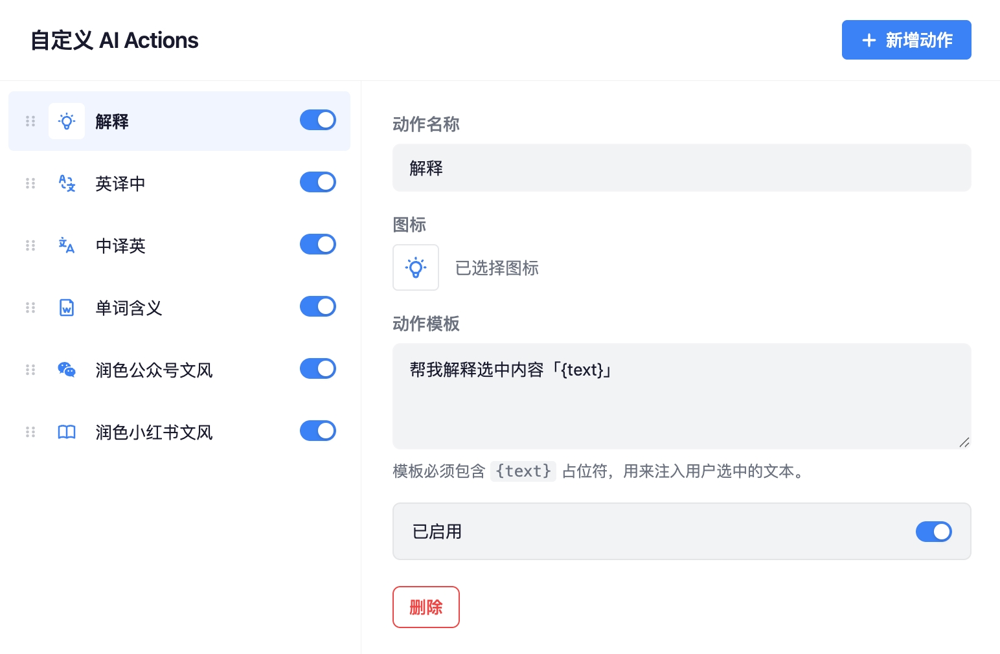
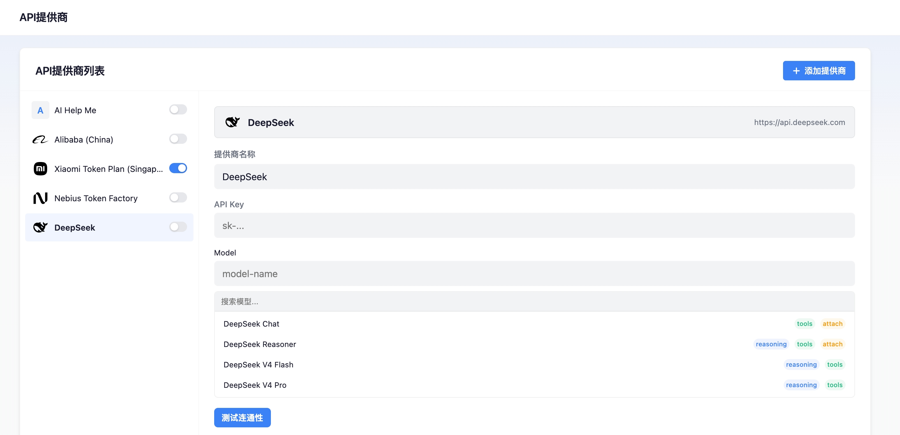

# AIction

> 选中文本 → 触发 AI → 继续对话

轻量级 Chrome 扩展，为网页选中内容提供 AI 辅助。支持任意 OpenAI 兼容的 `/chat/completions` 端点。

[](LICENSE)
[](https://chromewebstore.google.com/detail/YOUR_EXTENSION_ID)
[](package.json)

**[English](./README.md)**

## 功能特性

### 功能演示


**内联 AI 工具栏**

在任意网页选中文本，工具栏随即出现，提供可配置的 AI 动作。



**浮动聊天面板**

在可拖拽、可调整大小的面板中继续对话，支持流式响应。

**自定义动作**

创建自己的提示词模板，使用 `{text}` 占位符。内置动作：

| 动作 | 模板 |
|------|------|
| 解释 | `帮我解释选中内容「{text}」` |
| 翻译 | `请将以下内容翻译为简体中文：\n{text}` |



**多模型支持**

OpenAI、Anthropic Claude、Google Gemini、DeepSeek、OpenRouter，或任何 OpenAI 兼容 API。



**其他功能**

- 思维链展示 — 查看模型推理过程（DeepSeek `reasoning_content` 等）
- 深色模式 — 自动 / 浅色 / 深色主题
- PDF 查看器 — 内置 PDF 查看器，支持 AI 辅助
- 备份恢复 — 以 JSON 格式导入/导出配置

## 安装

**Chrome 应用商店**（推荐）

[从 Chrome 应用商店安装](YOUR_CHROME_WEBSTORE_LINK)

**开发者模式**

```bash
git clone https://github.com/YOUR_USERNAME/aiction.git
cd aiction
npm install
npm run dev
```

然后：
1. 打开 `chrome://extensions`
2. 开启"开发者模式"
3. 点击"加载已解压的扩展程序"
4. 选择 `.output/chrome-mv3` 目录

## 快速上手

1. 右键扩展图标 → **选项**
2. 添加模型服务（API URL + Key + Model）
3. 点击"测试连接"
4. 在任意网页选中文本 → 点击工具栏 → 选择动作

## 配置

### 模型服务

| 字段 | 说明 | 示例 |
|------|------|------|
| API Base URL | OpenAI 兼容端点 | `https://api.openai.com/v1` |
| API Key | API 密钥 | `sk-...` |
| Model | 模型标识符 | `gpt-4o-mini` |

### 模型参数

| 参数 | 默认值 | 范围 |
|------|--------|------|
| Max Tokens | 1024 | 1 - 32768 |
| Temperature | 0.3 | 0 - 2 |
| Top P | 0.9 | 0 - 1 |
| Presence Penalty | 0 | -2 - 2 |
| Frequency Penalty | 0 | -2 - 2 |

## 架构

```
内容脚本（选中文本、工具栏、聊天面板）
    ↓ chrome.runtime.connect（流式传输）
后台服务（AI API、存储）
    ↓ chrome.runtime.sendMessage（单次请求）
选项页（设置、模型、动作）
```

详细架构文档：[docs/WIKI.md](docs/WIKI.md)

## 技术栈

- [WXT](https://wxt.dev/) — 构建框架
- React 19 + TypeScript
- [Vercel AI SDK](https://sdk.vercel.ai/) — 流式 AI 调用
- Chrome Manifest V3

## 开发

### 命令

| 命令 | 说明 |
|------|------|
| `npm run dev` | 开发构建，监听文件变化 |
| `npm run dev:firefox` | Firefox 开发构建 |
| `npm run build` | 生产构建 |
| `npm run typecheck` | TypeScript 类型检查 |
| `npm run zip` | 打包扩展 |

### 路径别名

`~/*` 和 `@/*` 均映射到 `src/*`：

```typescript
import { useUiTheme } from "@/shared/ui/theme"
```

### 修改后验证

1. 运行 `npm run typecheck` 和 `npm run build`
2. 打开 `chrome://extensions`
3. 点击扩展的刷新按钮
4. 刷新目标网页

## 贡献

1. Fork 本仓库
2. 创建分支：`git checkout -b feature/xxx`
3. 进行修改
4. 运行 `npm run typecheck` 和 `npm run build`
5. 在 Chrome 中测试
6. 提交 Pull Request

## 许可证

[GPL-3.0](LICENSE)
